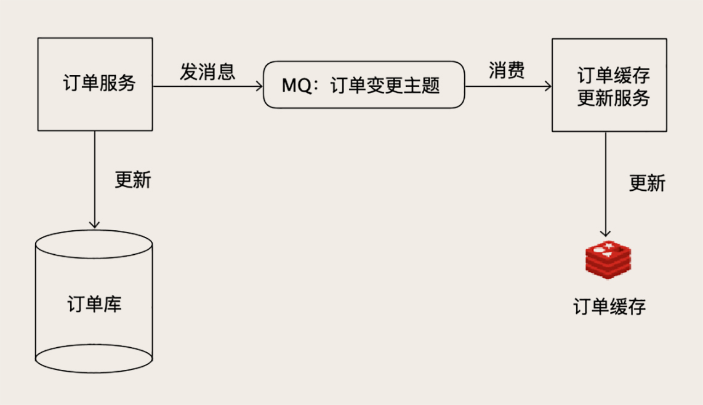
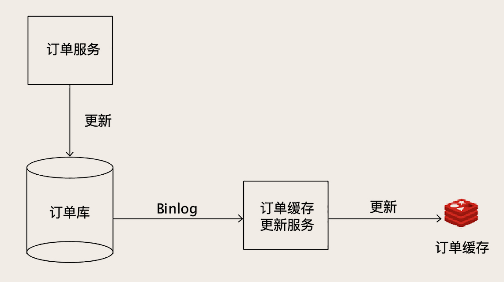
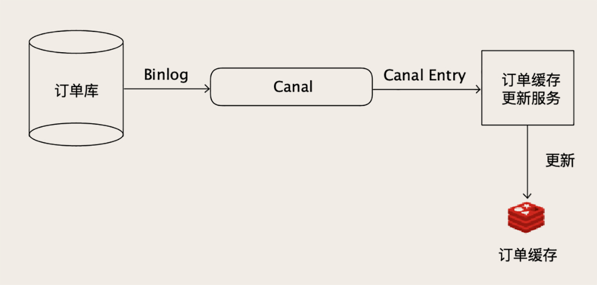

# 17 | 大厂都是怎么做MySQL to Redis同步的?
你好，我是李玥。

之前我们在《 [11 \| MySQL如何应对高并发（一）：使用缓存保护MySQL](https://time.geekbang.org/column/article/213230)》这一节课中，讲到了Read/Write Through和Cache Aside这几种更新缓存的策略，这几种策略都存在缓存穿透的可能，如果缓存没有命中，那就穿透缓存去访问数据库获取数据。

一般情况下，只要我们做好缓存预热，这个缓存的命中率很高，能穿透缓存打到数据库上的请求比例就非常低，这些缓存的策略都是没问题的。但是如果说，我们的Redis缓存服务的是一个超大规模的系统，那就又不一样了。

今天这节课，我们来说一下，在超大规模系统中缓存会面临什么样的问题，以及应该使用什么样的策略来更新缓存。

## 缓存穿透：超大规模系统的不能承受之痛

我们上节课讲到了如何构建Redis集群，由于集群可以水平扩容，那只要集群足够大，理论上支持海量并发也不是问题。但是，因为并发请求的数量这个基数太大了，即使有很小比率的请求穿透缓存，打到数据库上请求的绝对数量仍然不小。加上大促期间的流量峰值，还是存在缓存穿透引发雪崩的风险。

那这个问题怎么解决呢？其实方法你也想得到，不让请求穿透缓存不就行了？反正现在存储也便宜，只要你买得起足够多的服务器，Redis集群的容量就是无限的。不如把全量的数据都放在Redis集群里面，处理读请求的时候，干脆只读Redis，不去读数据库。这样就完全没有“缓存穿透”的风险了，实际上很多大厂它就是这么干的。

在Redis中缓存全量的数据，又引发了一个新的问题，那就是，如何来更新缓存中的数据呢？因为我们取消了缓存穿透的机制，这种情况下，从缓存读到数据可以直接返回，如果没读到数据，那就只能返回错误了！所以，当系统更新数据库的数据之后，必须及时去更新缓存。

说到这儿，又绕回到那个老问题上了：怎么保证Redis中的数据和数据库中的数据同步更新？我们之前讲过用分布式事务来解决数据一致性的问题，但是这些方法都不太适合用来更新缓存， **因为分布式事务，对数据更新服务有很强的侵入性**。我们拿下单服务来说，如果为了更新缓存增加一个分布式事务，无论我们用哪种分布式事务，或多或少都会影响下单服务的性能。还有一个问题是，如果Redis本身出现故障，写入数据失败，还会导致下单失败，等于是降低了下单服务性能和可用性，这样肯定不行。

**对于像订单服务这类核心的业务，一个可行的方法是，我们启动一个更新订单缓存的服务，接收订单变更的MQ消息，然后更新Redis中缓存的订单数据。** 因为这类核心的业务数据，使用方非常多，本来就需要发消息，增加一个消费订阅基本没什么成本，订单服务本身也不需要做任何更改。



唯一需要担心的一个问题是，如果丢消息了怎么办？因为现在消息是缓存数据的唯一来源，一旦出现丢消息，缓存里缺失的那条数据永远不会被补上。所以，必须保证整个消息链条的可靠性，不过好在现在的MQ集群，比如像Kafka或者RocketMQ，它都有高可用和高可靠的保证机制，只要你正确配置好，是可以满足数据可靠性要求的。

像订单服务这样，本来就有现成的数据变更消息可以订阅，这样更新缓存还是一个不错的选择，因为实现起来很简单，对系统的其他模块完全没有侵入。

## 使用Binlog实时更新Redis缓存

如果我们要缓存的数据，本来没有一份数据更新的MQ消息可以订阅怎么办？很多大厂都采用的，也是更通用的解决方案是这样的。

数据更新服务只负责处理业务逻辑，更新MySQL，完全不用管如何去更新缓存。负责更新缓存的服务，把自己伪装成一个MySQL的从节点，从MySQL接收Binlog，解析Binlog之后，可以得到实时的数据变更信息，然后根据这个变更信息去更新Redis缓存。



这种收Binlog更新缓存的方案，和刚刚我们讲到的，收MQ消息更新缓存的方案，其实它们的实现思路是一样的，都是异步订阅实时数据变更信息，去更新Redis。只不过，直接读取Binlog这种方式，它的通用性更强。不要求订单服务再发订单消息了，订单更新服务也不用费劲去解决“发消息失败怎么办？”这种数据一致性问题了。

而且，在整个缓存更新链路上，减少了一个收发MQ的环节，从MySQL更新到Redis更新的时延更短，出现故障的可能性也更低，所以很多大厂更青睐于这种方案。

这个方案唯一的缺点是，实现订单缓存更新服务有点儿复杂，毕竟不像收消息，拿到的直接就是订单数据，解析Binlog还是挺麻烦的。

有很多开源的项目就提供了订阅和解析MySQL Binlog的功能，下面我们以比较常用的开源项目 [Canal](https://github.com/alibaba/canal) 为例，来演示一下如何实时接收Binlog更新Redis缓存。

Canal模拟MySQL 主从复制的交互协议，把自己伪装成一个MySQL的从节点，向MySQL主节点发送dump请求，MySQL收到请求后，就会开始推送Binlog给Canal，Canal解析Binlog字节流之后，转换为便于读取的结构化数据，供下游程序订阅使用。下图是Canal的工作原理：



在我们这个示例中，MySQL和Redis都运行在本地的默认端口上，MySQL的端口为3306，Redis的端口为6379。为了便于大家操作，我们还是以《 [04 \| 事务：账户余额总是对不上账，怎么办？](https://time.geekbang.org/column/article/206544)》这节课中的账户余额表account\_balance作为演示数据。

首先，下载并解压Canal 最新的1.1.4版本到本地：

```
wget https://github.com/alibaba/canal/releases/download/canal-1.1.4/canal.deployer-1.1.4.tar.gz
tar zvfx canal.deployer-1.1.4.tar.gz

```

然后来配置MySQL，我们需要在MySQL的配置文件中开启Binlog，并设置Binlog的格式为ROW格式。

```
[mysqld]
log-bin=mysql-bin # 开启Binlog
binlog-format=ROW # 设置Binlog格式为ROW
server_id=1 # 配置一个ServerID

```

给Canal开一个专门的MySQL用户并授权，确保这个用户有复制Binlog的权限：

```
CREATE USER canal IDENTIFIED BY 'canal';
GRANT SELECT, REPLICATION SLAVE, REPLICATION CLIENT ON *.* TO 'canal'@'%';
FLUSH PRIVILEGES;

```

重启一下MySQL，确保所有的配置生效。重启后检查一下当前的Binlog文件和位置：


记录下File和Position两列的值，然后我们来配置Canal。编辑Canal的实例配置文件canal/conf/example/instance.properties，以便让Canal连接到我们的MySQL上。

```
canal.instance.gtidon=false

# position info
canal.instance.master.address=127.0.0.1:3306
canal.instance.master.journal.name=binlog.000009
canal.instance.master.position=155
canal.instance.master.timestamp=
canal.instance.master.gtid=

# username/password
canal.instance.dbUsername=canal
canal.instance.dbPassword=canal
canal.instance.connectionCharset = UTF-8
canal.instance.defaultDatabaseName=test
# table regex
canal.instance.filter.regex=.*\\..

```

这个配置文件需要配置MySQL的连接地址、库名、用户名和密码之外，还需要配置canal.instance.master.journal.name和canal.instance.master.position这两个属性，取值就是刚刚记录的File和Position两列。然后就可以启动Canal服务了：

```
canal/bin/startup.sh

```

启动之后看一下日志文件canal/logs/example/example.log，如果里面没有报错，就说明启动成功并连接到我们的MySQL上了。

Canal服务启动后，会开启一个端口（11111）等待客户端连接，客户端连接上Canal服务之后，可以从Canal服务拉取数据，每拉取一批数据，正确写入Redis之后，给Canal服务返回处理成功的响应。如果发生客户端程序宕机或者处理失败等异常情况，Canal服务没收到处理成功的响应，下次客户端来拉取的还是同一批数据，这样就可以保证顺序并且不会丢数据。

接下来我们来开发账户余额缓存的更新程序，以下的代码都是用Java语言编写的：

```
while (true) {
    Message message = connector.getWithoutAck(batchSize); // 获取指定数量的数据
    long batchId = message.getId();
    try {
        int size = message.getEntries().size();
        if (batchId == -1 || size == 0) {
            Thread.sleep(1000);
        } else {
            processEntries(message.getEntries(), jedis);
        }

        connector.ack(batchId); // 提交确认
    } catch (Throwable t) {
        connector.rollback(batchId); // 处理失败, 回滚数据
    }
}

```

这个程序逻辑也不复杂，程序启动并连接到Canal服务后，就不停地拉数据，如果没有数据就睡一会儿，有数据就调用processEntries方法处理更新缓存。每批数据更新成功后，就调用ack方法给Canal服务返回成功响应，如果失败抛异常就回滚。下面是processEntries方法的主要代码：

```
for (CanalEntry.RowData rowData : rowChage.getRowDatasList()) {
    if (eventType == CanalEntry.EventType.DELETE) { // 删除
        jedis.del(row2Key("user_id", rowData.getBeforeColumnsList()));
    } else if (eventType == CanalEntry.EventType.INSERT) { // 插入
        jedis.set(row2Key("user_id", rowData.getAfterColumnsList()), row2Value(rowData.getAfterColumnsList()));
    } else { // 更新
        jedis.set(row2Key("user_id", rowData.getAfterColumnsList()), row2Value(rowData.getAfterColumnsList()));
    }
}

```

这里面根据事件类型来分别处理，如果MySQL中的数据删除了，就删除Redis中对应的数据。如果是更新和插入操作，那就调用Redis的SET命令来写入数据。

把这个账户缓存更新服务启动后，我们来验证一下，我们在账户余额表插入一条记录：

```
mysql> insert into account_balance values (888, 100, NOW(), 999);

```

然后来看一下Redis缓存：

```
127.0.0.1:6379> get 888
"{\"log_id\":\"999\",\"balance\":\"100\",\"user_id\":\"888\",\"timestamp\":\"2020-03-08 16:18:10\"}"

```

可以看到数据已经自动同步到Redis中去了。我把这个示例的完整代码放在了 [GitHub](https://github.com/liyue2008/canal-to-redis-example) 上供你参考。

## 小结

在处理超大规模并发的场景时，由于并发请求的数量非常大，即使少量的缓存穿透，也有可能打死数据库引发雪崩效应。对于这种情况，我们可以缓存全量数据来彻底避免缓存穿透问题。

对于缓存数据更新的方法，可以订阅数据更新的MQ消息来异步更新缓存，更通用的方法是，把缓存更新服务伪装成一个MySQL的从节点，订阅MySQL的Binlog，通过Binlog来更新Redis缓存。

需要特别注意的是，无论是用MQ还是Canal来异步更新缓存，对整个更新服务的数据可靠性和实时性要求都比较高，数据丢失或者更新慢了，都会造成Redis中的数据与MySQL中数据不同步。在把这套方案应用到生产环境中去的时候，需要考虑一旦出现不同步问题时的降级或补偿方案。

## 思考题

课后请你思考一下，如果出现缓存不同步的情况，在你负责的业务场景下，该如何降级或者补偿？欢迎你在留言区与我讨论。

感谢你的阅读，如果你觉得今天的内容对你有帮助，也欢迎把它分享给你的朋友。