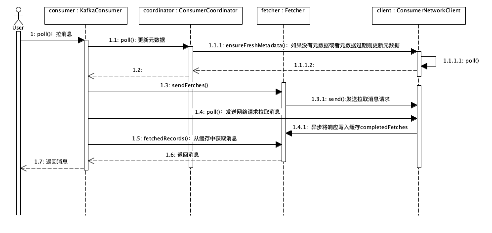
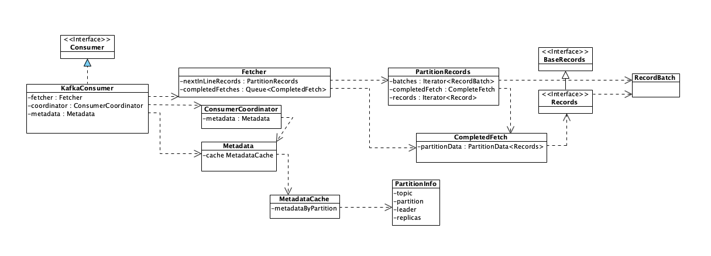

# 21 | Kafka Consumer源码分析：消息消费的实现过程
你好，我是李玥。

我们在上节课中提到过，用于解决消息队列一些常见问题的知识和原理，最终落地到代码上，都包含在收、发消息这两个流程中。对于消息队列的生产和消费这两个核心流程，在大部分消息队列中，它实现的主要流程都是一样的，所以，通过这两节课的学习之后，掌握了这两个流程的实现过程。无论你使用的是哪种消息队列，遇到收发消息的问题，你都可以用同样的思路去分析和解决问题。

上一节课我和你一起通过分析源代码学习了RocketMQ消息生产的实现过程，本节课我们来看一下Kafka消费者的源代码，理清Kafka消费的实现过程，并且能从中学习到一些Kafka的优秀设计思路和编码技巧。

在开始分析源码之前，我们一起来回顾一下Kafka消费模型的几个要点：

- Kafka的每个Consumer（消费者）实例属于一个ConsumerGroup（消费组）；
- 在消费时，ConsumerGroup中的每个Consumer独占一个或多个Partition（分区）；
- 对于每个ConsumerGroup，在任意时刻，每个Partition至多有1个Consumer在消费；
- 每个ConsumerGroup都有一个Coordinator(协调者）负责分配Consumer和Partition的对应关系，当Partition或是Consumer发生变更时，会触发rebalance（重新分配）过程，重新分配Consumer与Partition的对应关系；
- Consumer维护与Coordinator之间的心跳，这样Coordinator就能感知到Consumer的状态，在Consumer故障的时候及时触发rebalance。

掌握并理解Kafka的消费模型，对于接下来理解其消费的实现过程是至关重要的，如果你对上面的这些要点还有不清楚的地方，建议回顾一下之前的课程或者看一下Kafka相关的文档，然后再继续接下来的内容。

我们使用当前最新的版本2.2进行分析，使用Git在GitHub上直接下载源码到本地：

```
git clone git@github.com:apache/kafka.git
cd kafka
git checkout 2.2

```

在《 [09 \| 学习开源代码该如何入手？](https://time.geekbang.org/column/article/115519)》这节课中，我讲过，分析国外源码最好的方式就是从文档入手，接下来我们就找一下Kafka的文档，看看从哪儿来入手开启我们的分析流程。

Kafka的Consumer入口类 [KafkaConsumer的JavaDoc](https://kafka.apache.org/10/javadoc/?org/apache/kafka/clients/consumer/KafkaConsumer.html)，给出了关于如何使用KafkaConsumer非常详细的说明文档，并且给出了一个使用Consumer消费的最简代码示例：

```
     // 设置必要的配置信息
     Properties props = new Properties();
     props.put("bootstrap.servers", "localhost:9092");
     props.put("group.id", "test");
     props.put("enable.auto.commit", "true");
     props.put("auto.commit.interval.ms", "1000");
     props.put("key.deserializer", "org.apache.kafka.common.serialization.StringDeserializer");
     props.put("value.deserializer", "org.apache.kafka.common.serialization.StringDeserializer");

     // 创建Consumer实例
     KafkaConsumer<String, String> consumer = new KafkaConsumer<>(props);

     // 订阅Topic
     consumer.subscribe(Arrays.asList("foo", "bar"));

     // 循环拉消息
     while (true) {
         ConsumerRecords<String, String> records = consumer.poll(100);
         for (ConsumerRecord<String, String> record : records)
             System.out.printf("offset = %d, key = %s, value = %s%n", record.offset(), record.key(), record.value());
     }

```

这段代码主要的主要流程是：

1. 设置必要的配置信息，包括：起始连接的Broker地址，Consumer Group的ID，自动提交消费位置的配置和序列化配置；
2. 创建Consumer实例；
3. 订阅了2个Topic：foo 和 bar；
4. 循环拉取消息并打印在控制台上。

通过上面的代码实例我们可以看到，消费这个大的流程，在Kafka中实际上是被分成了“订阅”和“拉取消息”这两个小的流程。另外，我在之前的课程中反复提到过，Kafka在消费过程中，每个Consumer实例是绑定到一个分区上的，那Consumer是如何确定，绑定到哪一个分区上的呢？这个问题也是可以通过分析消费流程来找到答案的。所以，我们分析整个消费流程主要聚焦在三个问题上：

1. 订阅过程是如何实现的？
2. Consumer是如何与Coordinator协商，确定消费哪些Partition的？
3. 拉取消息的过程是如何实现的？

了解前两个问题，有助于你充分理解Kafka的元数据模型，以及Kafka是如何在客户端和服务端之间来交换元数据的。最后一个问题，拉取消息的实现过程，实际上就是消费的主要流程，我们上节课讲过，这是消息队列最核心的两个流程之一，也是必须重点掌握的。我们就带着这三个问题，来分析Kafka的订阅和拉取消息的过程如何实现。

## 订阅过程如何实现？

我们先来看看订阅的实现流程。从上面的例子跟踪到订阅的主流程方法：

```
  public void subscribe(Collection<String> topics, ConsumerRebalanceListener listener) {
      acquireAndEnsureOpen();
      try {
          // 省略部分代码

          // 重置订阅状态
          this.subscriptions.subscribe(new HashSet<>(topics), listener);

          // 更新元数据
          metadata.setTopics(subscriptions.groupSubscription());
      } finally {
          release();
      }
  }

```

在这个代码中，我们先忽略掉各种参数和状态检查的分支代码，订阅的主流程主要更新了两个属性：一个是订阅状态subscriptions，另一个是更新元数据中的topic信息。订阅状态subscriptions主要维护了订阅的topic和patition的消费位置等状态信息。属性metadata中维护了Kafka集群元数据的一个子集，包括集群的Broker节点、Topic和Partition在节点上分布，以及我们聚焦的第二个问题：Coordinator给Consumer分配的Partition信息。

请注意一下，这个subscribe()方法的实现有一个非常值得大家学习的地方：就是开始的acquireAndEnsureOpen()和try-finally release()，作用就是保护这个方法只能单线程调用。

Kafka在文档中明确地注明了Consumer不是线程安全的，意味着Consumer被并发调用时会出现不可预期的结果。为了避免这种情况发生，Kafka做了主动的检测并抛出异常，而不是放任系统产生不可预期的情况。

Kafka“ **主动检测不支持的情况并抛出异常，避免系统产生不可预期的行为**”这种模式，对于增强的系统的健壮性是一种非常有效的做法。如果你的系统不支持用户的某种操作，正确的做法是，检测不支持的操作，直接拒绝用户操作，并给出明确的错误提示，而不应该只是在文档中写上“不要这样做”，却放任用户错误的操作，产生一些不可预期的、奇怪的错误结果。

具体Kafka是如何实现的并发检测，大家可以看一下方法acquireAndEnsureOpen()的实现，很简单也很经典，我们就不再展开讲解了。

继续跟进到更新元数据的方法metadata.setTopics()里面，这个方法的实现除了更新元数据类Metadata中的topic相关的一些属性以外，还调用了Metadata.requestUpdate()方法请求更新元数据。

```
    public synchronized int requestUpdate() {
        this.needUpdate = true;
        return this.updateVersion;
    }

```

跟进到requestUpdate()的方法里面我们会发现，这里面并没有真正发送更新元数据的请求，只是将需要更新元数据的标志位needUpdate设置为true就结束了。Kafka必须确保在第一次拉消息之前元数据是可用的，也就是说在第一次拉消息之前必须更新一次元数据，否则Consumer就不知道它应该去哪个Broker上去拉哪个Partition的消息。

分析完订阅相关的代码，我们来总结一下：在订阅的实现过程中，Kafka更新了订阅状态subscriptions和元数据metadata中的相关topic的一些属性，将元数据状态置为“需要立即更新”，但是并没有真正发送更新元数据的请求，整个过程没有和集群有任何网络数据交换。

那这个元数据会在什么时候真正做一次更新呢？我们可以先带着这个问题接着看代码。

## 拉取消息的过程如何实现？

接下来，我们分析拉取消息的流程。这个流程的时序图如下（点击图片可放大查看）：



我们对着时序图来分析它的实现流程。在KafkaConsumer.poll()方法(对应源码1179行)的实现里面，可以看到主要是先后调用了2个私有方法：

1. updateAssignmentMetadataIfNeeded(): 更新元数据。
2. pollForFetches()：拉取消息。

方法updateAssignmentMetadataIfNeeded()中，调用了coordinator.poll()方法，poll()方法里面又调用了client.ensureFreshMetadata()方法，在client.ensureFreshMetadata()方法中又调用了client.poll()方法，实现了与Cluster通信，在Coordinator上注册Consumer并拉取和更新元数据。至此，“元数据会在什么时候真正做一次更新”这个问题也有了答案。

类ConsumerNetworkClient封装了Consumer和Cluster之间所有的网络通信的实现，这个类是一个非常彻底的异步实现。它没有维护任何的线程，所有待发送的Request都存放在属性unsent中，返回的Response存放在属性pendingCompletion中。每次调用poll()方法的时候，在当前线程中发送所有待发送的Request，处理所有收到的Response。

我们在之前的课程中讲到过，这种异步设计的优势就是用很少的线程实现高吞吐量，劣势也非常明显，极大增加了代码的复杂度。对比上节课我们分析的RocketMQ的代码，Producer和Consumer在主要收发消息流程上功能的复杂度是差不多的，但是你可以很明显地感受到Kafka的代码实现要比RocketMQ的代码实现更加的复杂难于理解。

我们继续分析方法pollForFetches()的实现。

```
    private Map<TopicPartition, List<ConsumerRecord<K, V>>> pollForFetches(Timer timer) {
        // 省略部分代码
        // 如果缓存里面有未读取的消息，直接返回这些消息
        final Map<TopicPartition, List<ConsumerRecord<K, V>>> records = fetcher.fetchedRecords();
        if (!records.isEmpty()) {
            return records;
        }
        // 构造拉取消息请求，并发送
        fetcher.sendFetches();
        // 省略部分代码
        // 发送网络请求拉取消息，等待直到有消息返回或者超时
        client.poll(pollTimer, () -> {
            return !fetcher.hasCompletedFetches();
        });
        // 省略部分代码
        // 返回拉到的消息
        return fetcher.fetchedRecords();
    }

```

这段代码的主要实现逻辑是：

1. 如果缓存里面有未读取的消息，直接返回这些消息；
2. 构造拉取消息请求，并发送；
3. 发送网络请求并拉取消息，等待直到有消息返回或者超时；
4. 返回拉到的消息。

在方法fetcher.sendFetches()的实现里面，Kafka根据元数据的信息，构造到所有需要的Broker的拉消息的Request，然后调用client.Send()方法将这些请求异步发送出去。并且，注册了一个回调类来处理返回的Response，所有返回的Response被暂时存放在Fetcher.completedFetches中。需要注意的是，这时的Request并没有被真正发给各个Broker，而是被暂存在了client.unsend中等待被发送。

然后，在调用client.poll()方法时，会真正将之前构造的所有Request发送出去，并处理收到的Response。

最后，fetcher.fetchedRecords()方法中，将返回的Response反序列化后转换为消息列表，返回给调用者。

综合上面的实现分析，我在这里给出整个拉取消息的流程涉及到的相关类的类图，在这个类图中，为了便于你理解，我并没有把所有类都绘制上去，只是把本节课两个流程相关的主要类和这些类里的关键属性画在了图中。你可以配合这个类图和上面的时序图进行代码阅读。

类图（点击图片可放大查看）：



## 小结

本节课我们一起分析了Kafka Consumer消费消息的实现过程。大家来分析代码过程中，不仅仅是要掌握Kafka整个消费的流程是是如何实现的，更重要的是理解它这种完全异步的设计思想。

发送请求时，构建Request对象，暂存入发送队列，但不立即发送，而是等待合适的时机批量发送。并且，用回调或者RequestFeuture方式，预先定义好如何处理响应的逻辑。在收到Broker返回的响应之后，也不会立即处理，而是暂存在队列中，择机处理。那这个择机策略就比较复杂了，有可能是需要读取响应的时候，也有可能是缓冲区满了或是时间到了，都有可能触发一次真正的网络请求，也就是在poll()方法中发送所有待发送Request并处理所有Response。

这种设计的好处是，不需要维护用于异步发送的和处理响应的线程，并且能充分发挥批量处理的优势，这也是Kafka的性能非常好的原因之一。这种设计的缺点也非常的明显，就是实现的复杂度太大了，如果没有深厚的代码功力，很难驾驭这么复杂的设计，并且后续维护的成本也很高。

总体来说，不推荐大家把代码设计得这么复杂。代码结构简单、清晰、易维护是是我们在设计过程中需要考虑的一个非常重要的因素。很多时候，为了获得较好的代码结构，在可接受的范围内，去牺牲一些性能，也是划算的。

## 思考题

我们知道，Kafka Consumer在消费过程中是需要维护消费位置的，Consumer每次从当前消费位置拉取一批消息，这些消息都被正常消费后，Consumer会给Coordinator发一个提交位置的请求，然后消费位置会向后移动，完成一批消费过程。那kafka Consumer是如何维护和提交这个消费位置的呢？请你带着这个问题再回顾一下Consumer的代码，尝试独立分析代码并找到答案。欢迎在留言区与我分享讨论。

感谢阅读，如果你觉得这篇文章对你有一些启发，也欢迎把它分享给你的朋友。