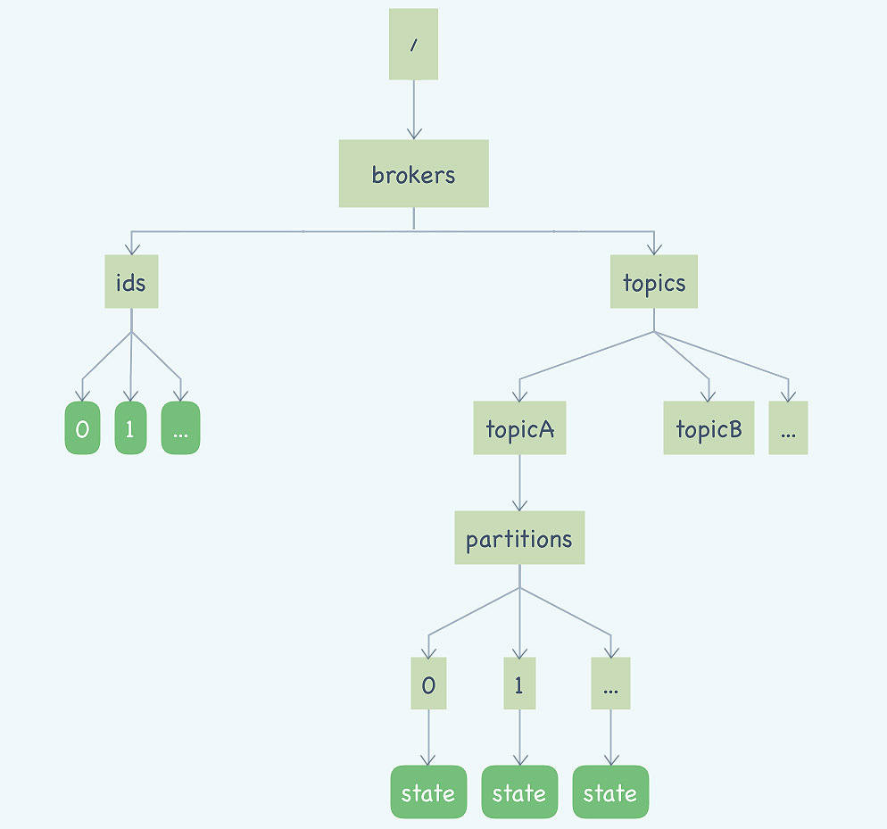

# 24 | Kafka的协调服务ZooKeeper：实现分布式系统的“瑞士军刀”
你好，我是李玥。

上节课我带你一起学习了RocketMQ NameServer的源代码，RocketMQ的NameServer虽然设计非常简洁，但很好地解决了路由寻址的问题。

而Kafka却采用了完全不同的设计思路，它选择使用ZooKeeper这样一个分布式协调服务来实现和RocketMQ的NameServer差不多的功能。

这节课我先带大家简单了解一下ZooKeeper，然后再来一起学习一下Kafka是如何借助ZooKeeper来构建集群，实现路由寻址的。

## ZooKeeper的作用是什么？

Apache ZooKeeper它是一个非常特殊的中间件，为什么这么说呢？一般来说，像中间件类的开源产品，大多遵循“做一件事，并做好它。”这样的UNIX哲学，每个软件都专注于一种功能上。而ZooKeeper更像是一个“瑞士军刀”，它提供了很多基本的操作，能实现什么样的功能更多取决于使用者如何来使用它。

ZooKeeper 作为一个分布式的协调服务框架，主要用来解决分布式集群中，应用系统需要面对的各种通用的一致性问题。ZooKeeper本身可以部署为一个集群，集群的各个节点之间可以通过选举来产生一个Leader，选举遵循半数以上的原则，所以一般集群需要部署奇数个节点。

ZooKeeper最核心的功能是，它提供了一个分布式的存储系统，数据的组织方式类似于UNIX文件系统的树形结构。由于这是一个可以保证一致性的存储系统，所以你可以放心地在你的应用集群中读写ZooKeeper的数据，而不用担心数据一致性的问题。分布式系统中一些需要整个集群所有节点都访问的元数据，比如集群节点信息、公共配置信息等，特别适合保存在ZooKeeper中。

在这个树形的存储结构中，每个节点被称为一个“ZNode”。ZooKeeper提供了一种特殊的ZNode类型：临时节点。这种临时节点有一个特性：如果创建临时节点的客户端与ZooKeeper集群失去连接，这个临时节点就会自动消失。在ZooKeeper内部，它维护了ZooKeeper集群与所有客户端的心跳，通过判断心跳的状态，来确定是否需要删除客户端创建的临时节点。

ZooKeeper还提供了一种订阅ZNode状态变化的通知机制：Watcher，一旦ZNode或者它的子节点状态发生了变化，订阅的客户端会立即收到通知。

利用ZooKeeper临时节点和Watcher机制，我们很容易随时来获取业务集群中每个节点的存活状态，并且可以监控业务集群的节点变化情况，当有节点上下线时，都可以收到来自ZooKeeper的通知。

此外，我们还可以用ZooKeeper来实现业务集群的快速选举、节点间的简单通信、分布式锁等很多功能。

下面我带你一起来看一下Kafka是如何来使用ZooKeeper的。

## Kafka在ZooKeeper中保存了哪些信息？

首先我们来看一下Kafka在ZooKeeper都保存了哪些信息，我把这些ZNode整理了一张图方便你来学习。



你可能在网上看到过和这个图类似的其他版本的图，这些图中绘制的ZNode比我们这张图要多一些，这些图大都是描述的0.8.x的旧版本的情况，最新版本的Kafka已经将消费位置管理等一些原本依赖ZooKeeper实现的功能，替换成了其他的实现方式。

图中圆角的矩形是临时节点，直角矩形是持久化的节点。

我们从左往右来看，左侧这棵树保存的是Kafka的Broker信息，/brokers/ids/\[0…N\]，每个临时节点对应着一个在线的Broker，Broker启动后会创建一个临时节点，代表Broker已经加入集群可以提供服务了，节点名称就是BrokerID，节点内保存了包括Broker的地址、版本号、启动时间等等一些Broker的基本信息。如果Broker宕机或者与ZooKeeper集群失联了，这个临时节点也会随之消失。

右侧部分的这棵树保存的就是主题和分区的信息。/brokers/topics/节点下面的每个子节点都是一个主题，节点的名称就是主题名称。每个主题节点下面都包含一个固定的partitions节点，pattitions节点的子节点就是主题下的所有分区，节点名称就是分区编号。

每个分区节点下面是一个名为state的临时节点，节点中保存着分区当前的leader和所有的ISR的BrokerID。这个state临时节点是由这个分区当前的Leader Broker创建的。如果这个分区的Leader Broker宕机了，对应的这个state临时节点也会消失，直到新的Leader被选举出来，再次创建state临时节点。

## Kafka客户端如何找到对应的Broker？

那Kafka客户端如何找到主题、队列对应的Broker呢？其实，通过上面ZooKeeper中的数据结构，你应该已经可以猜的八九不离十了。是的，先根据主题和队列，在右边的树中找到分区对应的state临时节点，我们刚刚说过，state节点中保存了这个分区Leader的BrokerID。拿到这个Leader的BrokerID后，再去左侧的树中，找到BrokerID对应的临时节点，就可以获取到Broker真正的访问地址了。

在《 [21 \| Kafka Consumer源码分析：消息消费的实现过程](https://time.geekbang.org/column/article/135120)》这一节课中，我讲过，Kafka的客户端并不会去直接连接ZooKeeper，它只会和Broker进行远程通信，那我们可以合理推测一下，ZooKeeper上的元数据应该是通过Broker中转给每个客户端的。

下面我们一起看一下Kafka的源代码，来验证一下我们的猜测是不是正确的。

在之前的课程中，我和大家讲过，客户端真正与服务端发生网络传输是在org.apache.kafka.clients.NetworkClient#poll方法中实现的，我们一直跟踪这个调用链：

```
NetworkClient#poll() -> DefaultMetadataUpdater#maybeUpdate(long) -> DefaultMetadataUpdater#maybeUpdate(long, Node)

```

直到maybeUpdate(long, Node)这个方法，在这个方法里面，Kafka构造了一个更新元数据的请求：

```
private long maybeUpdate(long now, Node node) {
    String nodeConnectionId = node.idString();

    if (canSendRequest(nodeConnectionId, now)) {
        // 构建一个更新元数据的请求的构造器
        Metadata.MetadataRequestAndVersion metadataRequestAndVersion = metadata.newMetadataRequestAndVersion();
        inProgressRequestVersion = metadataRequestAndVersion.requestVersion;
        MetadataRequest.Builder metadataRequest = metadataRequestAndVersion.requestBuilder;
        log.debug("Sending metadata request {} to node {}", metadataRequest, node);
        // 发送更新元数据的请求
        sendInternalMetadataRequest(metadataRequest, nodeConnectionId, now);
        return defaultRequestTimeoutMs;
    }

    //...
}

```

这段代码先构造了更新元数据的请求的构造器，然后调用sendInternalMetadataRequest()把这个请求放到待发送的队列中。这里面有两个地方我需要特别说明一下。

第一点是，在这个方法里面创建的并不是一个真正的更新元数据的MetadataRequest，而是一个用于构造MetadataRequest的构造器MetadataRequest.Builder，等到真正要发送请求之前，Kafka才会调用Builder.buid()方法把这个MetadataRequest构建出来然后发送出去。而且，不仅是元数据的请求，所有的请求都是这样来处理的。

第二点是，调用sendInternalMetadataRequest()方法时，这个请求也并没有被真正发出去，依然是保存在待发送的队列中，然后择机来异步批量发送。

请求的具体内容封装在org.apache.kafka.common.requests.MetadataRequest这个对象中，它包含的信息很简单，只有一个主题的列表，来表明需要获取哪些主题的元数据，另外还有一个布尔类型的字段allowAutoTopicCreation，表示是否允许自动创建主题。

然后我们再来看下，在Broker中，Kafka是怎么来处理这个更新元数据的请求的。

Broker处理所有RPC请求的入口类在kafka.server.KafkaApis#handle这个方法里面，我们找到对应处理更新元数据的方法handleTopicMetadataRequest(RequestChannel.Request)，这段代码是用Scala语言编写的：

```
  def handleTopicMetadataRequest(request: RequestChannel.Request) {
    val metadataRequest = request.body[MetadataRequest]
    val requestVersion = request.header.apiVersion

    // 计算需要获取哪些主题的元数据
    val topics =
      // 在旧版本的协议中，每次都获取所有主题的元数据
      if (requestVersion == 0) {
        if (metadataRequest.topics() == null || metadataRequest.topics.isEmpty)
          metadataCache.getAllTopics()
        else
          metadataRequest.topics.asScala.toSet
      } else {
        if (metadataRequest.isAllTopics)
          metadataCache.getAllTopics()
        else
          metadataRequest.topics.asScala.toSet
      }

    // 省略掉鉴权相关代码
    // ...

    val topicMetadata =
      if (authorizedTopics.isEmpty)
        Seq.empty[MetadataResponse.TopicMetadata]
      else
        // 从元数据缓存过滤出相关主题的元数据
        getTopicMetadata(metadataRequest.allowAutoTopicCreation, authorizedTopics, request.context.listenerName,
          errorUnavailableEndpoints, errorUnavailableListeners)

    // ...
    // 获取所有Broker列表
    val brokers = metadataCache.getAliveBrokers

    trace("Sending topic metadata %s and brokers %s for correlation id %d to client %s".format(completeTopicMetadata.mkString(","),
      brokers.mkString(","), request.header.correlationId, request.header.clientId))

    // 构建Response并发送
    sendResponseMaybeThrottle(request, requestThrottleMs =>
      new MetadataResponse(
        requestThrottleMs,
        brokers.flatMap(_.getNode(request.context.listenerName)).asJava,
        clusterId,
        metadataCache.getControllerId.getOrElse(MetadataResponse.NO_CONTROLLER_ID),
        completeTopicMetadata.asJava
      ))
  }

```

这段代码的主要逻辑是，先根据请求中的主题列表，去本地的元数据缓存MetadataCache中过滤出相应主题的元数据，也就是我们上面那张图中，右半部分的那棵树的子集，然后再去本地元数据缓存中获取所有Broker的集合，也就是上图中左半部分那棵树，最后把这两部分合在一起，作为响应返回给客户端。

Kafka在每个Broker中都维护了一份和ZooKeeper中一样的元数据缓存，并不是每次客户端请求元数据就去读一次ZooKeeper。由于ZooKeeper提供了Watcher这种监控机制，Kafka可以感知到ZooKeeper中的元数据变化，从而及时更新Broker中的元数据缓存。

这样就完成了一次完整的更新元数据的流程。通过分析代码，可以证实，我们开始的猜测都是没有问题的。

## 小结

最后我们对这节课的内容做一个总结。

首先，我们简单的介绍了ZooKeeper，它是一个分布式的协调服务，它的核心服务是一个高可用、高可靠的一致性存储，在此基础上，提供了包括读写元数据、节点监控、选举、节点间通信和分布式锁等很多功能， **这些功能可以极大方便我们快速开发一个分布式的集群系统。**

但是，ZooKeeper也并不是完美的，在使用的时候你需要注意几个问题：

1. 不要往ZooKeeper里面写入大量数据，它不是一个真正意义上的存储系统，只适合存放少量的数据。依据服务器配置的不同，ZooKeeper在写入超过几百MB数据之后，性能和稳定性都会严重下降。
2. 不要让业务集群的可用性依赖于ZooKeeper的可用性，什么意思呢？你的系统可以使用Zookeeper，但你要留一手，要考虑如果Zookeeper集群宕机了，你的业务集群最好还能提供服务。因为ZooKeeper的选举过程是比较慢的，而它对网络的抖动又比较敏感，一旦触发选举，这段时间内的ZooKeeper是不能提供任何服务的。

Kafka主要使用ZooKeeper来保存它的元数据、监控Broker和分区的存活状态，并利用ZooKeeper来进行选举。

Kafka在ZooKeeper中保存的元数据，主要就是Broker的列表和主题分区信息两棵树。这份元数据同时也被缓存到每一个Broker中。客户端并不直接和ZooKeeper来通信，而是在需要的时候，通过RPC请求去Broker上拉取它关心的主题的元数据，然后保存到客户端的元数据缓存中，以便支撑客户端生产和消费。

可以看到，目前Kafka的这种设计，集群的可用性是严重依赖ZooKeeper的，也就是说，如果ZooKeeper集群不能提供服务，那整个Kafka集群也就不能提供服务了，这其实是一个不太好的设计。

如果你需要要部署大规模的Kafka集群，建议的方式是，拆分成多个互相独立的小集群部署，每个小集群都使用一组独立的ZooKeeper提供服务。这样，每个ZooKeeper中存储的数据相对比较少，并且如果某个ZooKeeper集群故障，只会影响到一个小的Kafka集群，故障的影响面相对小一些。

Kafka的开发者也意识到了这个问题，目前正在讨论开发一个元数据服务来替代ZooKeeper，感兴趣的同学可以看一下他们的 [Proposal](https://cwiki.apache.org/confluence/display/KAFKA/KIP-500%3A+Replace+ZooKeeper+with+a+Self-Managed+Metadata+Quorum)。

## 思考题

本节课的思考题是这样的，请你顺着我们这节课源码分析的思路继续深挖进去，看一下Broker中的元数据缓存，又是如何与ZooKeeper中的元数据保持同步的呢？欢迎在留言区写下你的想法。

感谢阅读，如果你觉得这篇文章对你有帮助的话，也欢迎把它分享给你的朋友。